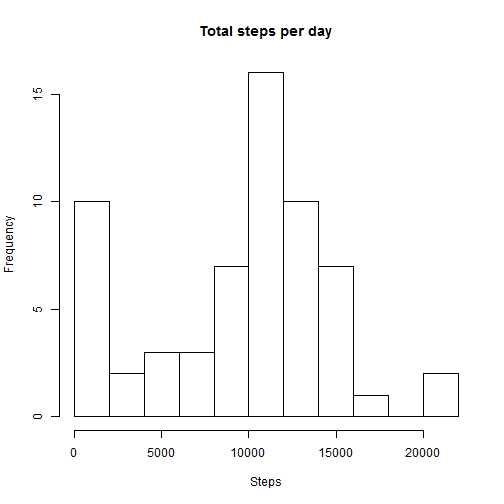
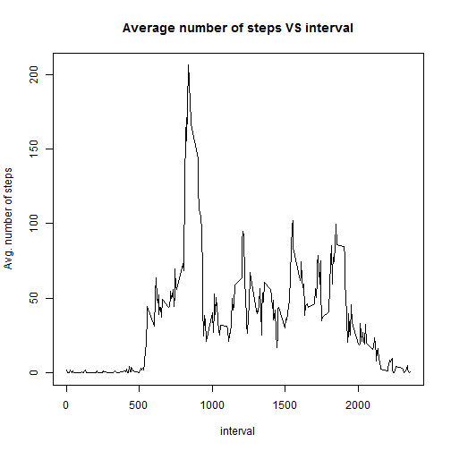
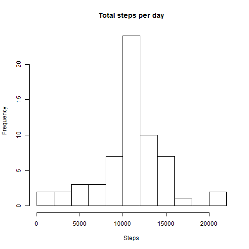

## Loading and preprocessing the data

### Load the data


```r
## Load the data
activity<-read.csv("activity.csv")
#str(activity)
```

### Process the data into a format suitable for analysis


```r
## Process the data into a format suitable for analysis

#load the dplyr package and convert activity into a data table
#convert the date date field into date type
activity_tbl$date<-strptime(activity_tbl$date, "%m/%d/%Y")
```

```
## Error in strptime(activity_tbl$date, "%m/%d/%Y"): object 'activity_tbl' not found
```

```r
library(dplyr)
```

```
## Warning: package 'dplyr' was built under R version 3.1.2
```

```
## 
## Attaching package: 'dplyr'
## 
## The following object is masked from 'package:stats':
## 
##     filter
## 
## The following objects are masked from 'package:base':
## 
##     intersect, setdiff, setequal, union
```

```r
activity_tbl<-tbl_df(activity)
#str(activity_tbl)
```


## What is mean total number of steps taken per day?


```r
#Calculate the total number of steps per day
steps_perday<-group_by(activity_tbl, date)
steps_perday<-summarize(steps_perday, tsteps_perday=sum(steps, na.rm=TRUE))
head(steps_perday)
```

```
## Source: local data frame [6 x 2]
## 
##         date tsteps_perday
## 1  10/1/2012             0
## 2 10/10/2012          9900
## 3 10/11/2012         10304
## 4 10/12/2012         17382
## 5 10/13/2012         12426
## 6 10/14/2012         15098
```

### Create the histogram of total steps per day


```r
#Create the histogram of total steps per day
hist(steps_perday$tsteps_perday, main="Total steps per day",
     xlab="Steps", breaks=10)
```

 

### Mean and Median total number of steps per day


```r
## Mean and Median total number of steps per day

msteps_perday<-summarize(steps_perday, meansteps_perday=mean(tsteps_perday, na.rm=TRUE), mediansteps_perday=median(tsteps_perday, na.rm=TRUE))
head(msteps_perday)
```

```
## Source: local data frame [1 x 2]
## 
##   meansteps_perday mediansteps_perday
## 1          9354.23              10395
```

## What is the average daily activity pattern?

### Create the time series plot average steps per interval


```r
## Time series plot of steps vs intervals

#Calculate the average number of steps per interval
steps_perinterval<-group_by(activity_tbl, interval)
steps_perinterval<-summarize(steps_perinterval, msteps_perinterval=mean(steps, na.rm=TRUE))
head(steps_perinterval)
```

```
## Source: local data frame [6 x 2]
## 
##   interval msteps_perinterval
## 1        0          1.7169811
## 2        5          0.3396226
## 3       10          0.1320755
## 4       15          0.1509434
## 5       20          0.0754717
## 6       25          2.0943396
```

```r
str(steps_perinterval)
```

```
## Classes 'tbl_df', 'tbl' and 'data.frame':	288 obs. of  2 variables:
##  $ interval          : int  0 5 10 15 20 25 30 35 40 45 ...
##  $ msteps_perinterval: num  1.717 0.3396 0.1321 0.1509 0.0755 ...
##  - attr(*, "drop")= logi TRUE
```

```r
#Create the time series plot average steps per interval
with(steps_perinterval, plot(interval, msteps_perinterval, type="l", ylab="Avg. number of steps", main="Average number of steps VS interval"))
```

 

### Which 5-minute interval, on average across all the days in the dataset, contains the maximum number of steps?


```r
## 5 minute interval with the maximum average number of steps per day

intval_maxavgsteps<-filter(steps_perinterval, msteps_perinterval==max(msteps_perinterval))
```

The interval is 835.

## Imputing missing values

### Total number of rows with missing values in the dataset


```r
## Total number of rows with missing values in the dataset

nrow(activity_tbl)-sum(complete.cases(activity_tbl))
```

```
## [1] 2304
```

### Devise a strategy for filling in all of the missing values in the data set 

The data sets activity_tbl and steps_perinterval will be merged together with interval as the 
merging field. The former data set has the individual number of steps with the NA values, whereas 
the latter dataset has the average number of steps for each of the interval. Then, the missing cells under the steps column will be assigned the corresponding values under the msteps_perinterval column.

### Create a new dataset with the missing values

```r
activity_nomissing<-merge(activity_tbl, steps_perinterval, by="interval")
activity_nomissing[is.na(activity_nomissing$steps),]$steps<-activity_nomissing[is.na(activity_nomissing$steps),]$msteps_perinterval
str(activity_nomissing)
```

```
## 'data.frame':	17568 obs. of  4 variables:
##  $ interval          : int  0 0 0 0 0 0 0 0 0 0 ...
##  $ steps             : num  1.72 0 0 0 0 ...
##  $ date              : Factor w/ 61 levels "10/1/2012","10/10/2012",..: 1 47 21 58 48 38 13 39 59 49 ...
##  $ msteps_perinterval: num  1.72 1.72 1.72 1.72 1.72 ...
```


### Histogram of total number of steps taken each day


```r
#Calculate the total number of steps per day
nmsteps_perday<-group_by(activity_nomissing, date)
nmsteps_perday<-summarize(nmsteps_perday, tsteps_perday=sum(steps, na.rm=TRUE))
head(nmsteps_perday)
```

```
## Source: local data frame [6 x 2]
## 
##         date tsteps_perday
## 1  10/1/2012      10766.19
## 2 10/10/2012       9900.00
## 3 10/11/2012      10304.00
## 4 10/12/2012      17382.00
## 5 10/13/2012      12426.00
## 6 10/14/2012      15098.00
```

```r
#Create the histogram of total steps per day
hist(nmsteps_perday$tsteps_perday, main="Total steps per day",
     xlab="Steps", breaks=10)
```

 


### Mean and Median total number of steps per day


```r
nmmsteps_perday<-summarize(nmsteps_perday, meansteps_perday=mean(tsteps_perday, na.rm=TRUE), mediansteps_perday=median(tsteps_perday, na.rm=TRUE))
head(nmmsteps_perday)
```

```
## Source: local data frame [1 x 2]
## 
##   meansteps_perday mediansteps_perday
## 1         10766.19           10766.19
```

### Do these values differ from the estimates from the first part of the assignment?

This mean and median of total number of steps per day are different than the ones calculated from the dataset with missing values. Mean and median now 1.0766189 &times; 10<sup>4</sup>, 1.0766189 &times; 10<sup>4</sup>, respectively vs 9354.2295082, 10395 previously.   

###  What is the impact of imputing missing data on the estimates of the total daily number of steps?

Because of replacing the NAs with positive values, total number of steps per day is larger now than the previous case. In the previous case, number of steps were effectively 0 for the cases with missing values which is less than a positive value in the current case. That is why the mean steps per day is now 10766.19, which is greater than 9354.23 from the previous case. Median steps per day is also larger now (10766.19 vs 10395).

## Are there differences in activity patterns between weekdays and weekends?


```r
# load package chron
library(chron)
```

```
## Warning: package 'chron' was built under R version 3.1.2
```

### Create a new factor variable in the dataset with two levels - "weekday" and "weekend" indicating whether a given date is a weekday or weekend day.


```r
act_nomis<-mutate(activity_nomissing, wdornot=is.weekend(date))
act_nomis[act_nomis$wdornot,]$wdornot<-"weekend"
act_nomis[act_nomis$wdornot==FALSE,]$wdornot<-"weekday"
act_nomis$wdornot<-as.factor(act_nomis$wdornot)
str(act_nomis)
```

```
## 'data.frame':	17568 obs. of  5 variables:
##  $ interval          : int  0 0 0 0 0 0 0 0 0 0 ...
##  $ steps             : num  1.72 0 0 0 0 ...
##  $ date              : Factor w/ 61 levels "10/1/2012","10/10/2012",..: 1 47 21 58 48 38 13 39 59 49 ...
##  $ msteps_perinterval: num  1.72 1.72 1.72 1.72 1.72 ...
##  $ wdornot           : Factor w/ 2 levels "weekday","weekend": 1 1 2 1 2 1 2 1 1 2 ...
```

### Make a panel plot containing a time series plot (i.e. type = "l") of the 5-minute interval (x-axis) and the average number of steps taken, averaged across all weekday days or weekend days (y-axis).


```r
#Calculate the total number of steps per interval 
nmsteps_perintwdnot<-group_by(act_nomis, interval, wdornot)
nmsteps_perintwdnot<-summarize(nmsteps_perintwdnot, msteps_perday=mean(steps, na.rm=TRUE))

# load the lattice package

library(lattice)
xyplot(msteps_perday~interval|wdornot, nmsteps_perintwdnot, type="l", ylab="number of steps", layout=c(1,2))
```

 
